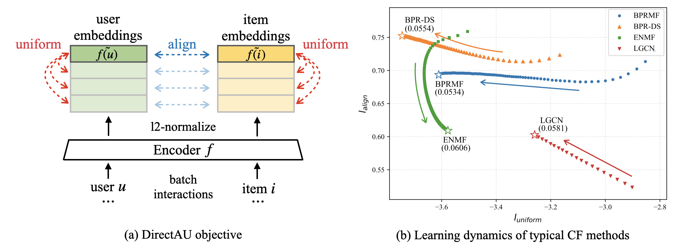
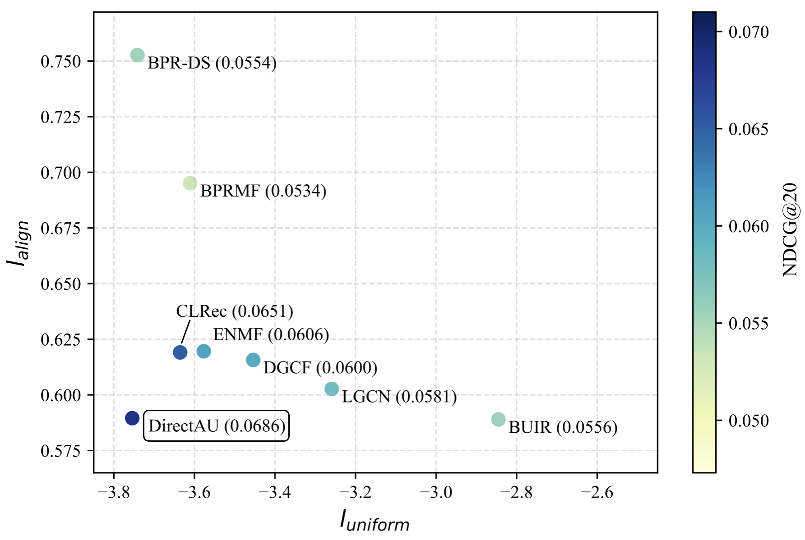

# DirectAU



Implementation of the paper "[Towards Representation Alignment and Uniformity in Collaborative Filtering](https://arxiv.org/abs/2206.12811)" in KDD'22.

This work investigates the desired properties of representations in collaborative filtering (CF) from the perspective of *alignment* and *uniformity*. The proposed [DirectAU](https://github.com/THUwangcy/DirectAU/blob/main/recbole/model/general_recommender/directau.py) provides a new learning objective for CF-based recommender systems, which directly optimizes representation alignment and uniformity on the hypersphere. A simple MF encoder optimizing this loss can achieve superior performance compared to SOTA CF methods. 

## Training with DirectAU

This learning objective is easy to implement as follows (PyTorch-style):

```python
@staticmethod
def alignment(x, y):
    x, y = F.normalize(x, dim=-1), F.normalize(y, dim=-1)
    return (x - y).norm(p=2, dim=1).pow(2).mean()

@staticmethod
def uniformity(x):
    x = F.normalize(x, dim=-1)
    return torch.pdist(x, p=2).pow(2).mul(-2).exp().mean().log()

def calculate_loss(self, user, item):
    user_e, item_e = self.encoder(user, item)  # [bsz, dim]
    align = self.alignment(user_e, item_e)
    uniform = (self.uniformity(user_e) + self.uniformity(item_e)) / 2
    loss = align + self.gamma * uniform
    return loss
```

We integrate our DirectAU method ([directau.py](https://github.com/THUwangcy/DirectAU/blob/main/recbole/model/general_recommender/directau.py)) into the [RecBole](https://recbole.io/) framework. The datasets used in the paper are already included in the [dataset](https://github.com/THUwangcy/DirectAU/tree/main/dataset) folder. Related experimental settings can be found in the [properties](https://github.com/THUwangcy/DirectAU/tree/main/recbole/properties) folder. To reproduce the results, you can run the following commands after installing all the [requirements](https://github.com/THUwangcy/DirectAU/blob/main/requirements.txt):

```shell
# Beauty
python run_recbole.py \
    --model=DirectAU --dataset=Beauty \
    --learning_rate=1e-3 --weight_decay=1e-6 \
    --gamma=0.5 --encoder=MF --train_batch_size=256

# Gowalla
python run_recbole.py \
    --model=DirectAU --dataset=Gowalla \
    --learning_rate=1e-3 --weight_decay=1e-6 \
    --gamma=5 --encoder=MF --train_batch_size=1024

# Yelp2018
python run_recbole.py \
    --model=DirectAU --dataset=Yelp \
    --learning_rate=1e-3 --weight_decay=1e-6 \
    --gamma=1 --encoder=MF --train_batch_size=1024
```

To test DirectAU on other datasets, you should prepare datasets similar to the existing ones. More explanations about the dataset format can be found in the [Atomic Files](https://recbole.io/atomic_files.html) of RecBole. 

The main hyper-parameters of DirectAU includes:

| Param              | Default | Description                                    |
| ------------------ | ------- | ---------------------------------------------- |
| `--embedding_size` | 64      | The embedding size.                            |
| `--gamma`          | 1       | The weight of the uniformity loss.             |
| `--encoder`        | MF      | The encoder type: MF / LightGCN                |
| `--n_layers`       | None    | The number of layers when `--encoder=LightGCN` |

You can use the following command to tune hyper-parameters in DirectAU (more details see [Parameter Tuning](https://recbole.io/docs/user_guide/usage/parameter_tuning.html) in RecBole):

```shell
python run_hyper.py \
    --model=DirectAU --dataset=Beauty \
    --config_files='recbole/properties/overall.yaml recbole/properties/model/DirectAU.yaml recbole/properties/dataset/sample.yaml' \
    --params_file=directau.hyper \
    --output_file=hyper.result
```

## Measuring Alignment and Uniformity

The measurement of alignment and uniformity given the learned representations can be implemented as follows (Appendix A.2 in the paper):

```python
def overall_align(user_index, item_index, user_emb, item_emb):
    """ Args:
    user_index (torch.LongTensor): user ids of positive interactions, shape: [|R|, ]
    item_index (torch.LongTensor): item ids of positive interactions, shape: [|R|, ]
    user_emb (torch.nn.Embedding): user embeddings of all the users, shape: [|U|, dim]
    item_emb (torch.nn.Embedding): item embeddings of all the items, shape: [|I|, dim]
    """
    x = F.normalize(user_emb[user_index], dim=-1)
    y = F.normalize(item_emb[item_index], dim=-1)
    return (x - y).norm(p=2, dim=1).pow(alpha).mean()

def overall_uniform(index_list, embedding):
    """ Args:
    index_list (torch.LongTensor): user/item ids of positive interactions, shape: [|R|, ]
    embedding (torch.nn.Embedding): user/item embeddings, shape: [|U|, dim] or [|I|, dim]
    """ 
    values, _= torch.sort(index_list)
    count_series = pd.value_counts(values.tolist(), sort=False)
    count = torch.from_numpy(count_series.values).unsqueeze(0)

    weight_matrix = torch.mm(count.transpose(-1, 0), count)
    weight = torch.triu(weight_matrix, 1).view(-1)[
        torch.nonzero(torch.triu(weight_matrix, 1).view(-1)).view(-1)].to(embedding.device)
    total_freq = (len(index_list) * len(index_list) - weight_matrix.trace()) / 2

    return torch.pdist(embedding[count_series.index], p=2).pow(2).mul(-2).exp().mul(weight).sum().div(total_freq).log()
```



## Citation

If you find this work is helpful to your research, please consider citing our paper:

```
TBD
```

## Contact

Chenyang Wang ([THUwangcy@gmail.com](mailto:THUwangcy@gmail.com))
